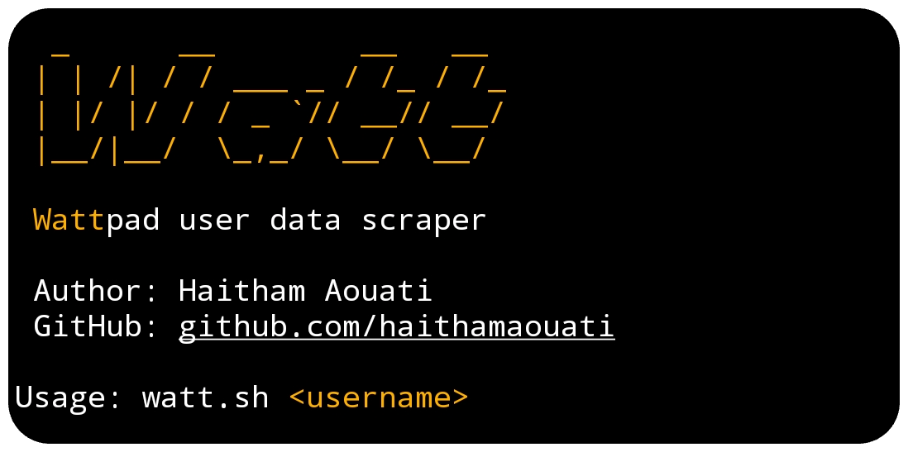

# Watt
**Watt**pad user data scraper.



## Install

To use the Watt script, follow these steps:

1. Clone the repository:

    ```
    git clone https://github.com/haithamaouati/Watt.git
    ```

2. Change to the Watt directory:

    ```
    cd Watt
    ```
    
3. Change the file modes
    ```
    chmod +x watt.sh
    ```
    
5. Run the script:

    ```
    ./watt.sh
    ```
## Usage

Usage: `./watt.sh <@username>` or `[username]`

## Dependencies
The script requires the following dependencies:

- **curl**: `pkg install curl - y`
- **jq**: `pkg install jq -y`

> [!IMPORTANT]  
> Make sure to install these **dependencies** before running the script.

> [!NOTE]  
> Ensure that the Wattpad user account is public to access their information.

> [!TIP]
> The scraping technique relies on the current structure of the Wattpad website, which may change.

## Environment
- Tested on [Termux](https://termux.dev/en/)

## Disclaimer
>[!CAUTION]
>This Tool is only for educational purposes

> [!WARNING]
> We are not responsible for any misuse or damage caused by this program. use this tool at your own risk!

## Star History

[](https://www.star-history.com/#haithamaouati/Watt&type=date&legend=top-left)

#### Find this repository useful? ♥️
Support it by joining the [stargazers](https://github.com/haithamaouati/Watt/stargazers). ⭐

If you want to help even more, please spread the word — share the project on X, Reddit, or with your community so more people discover it.

And [follow me](https://github.com/haithamaouati) to keep up with future updates and projects. 🤩


## License

Watt is licensed under [WTFPL license](LICENSE).
